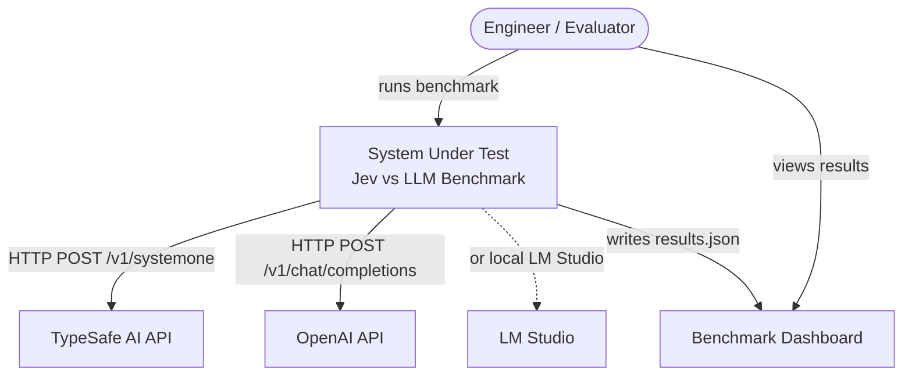

# Jev vs LLM Latency Benchmark

[](https://github.com/Chronona/jev-llm-benchmark/actions/workflows/ci.yml)
[](https://github.com/Chronona/jev-llm-benchmark/actions/workflows/deploy.yml)
[](LICENSE)


Latency benchmark comparing TypeSafe Jev (System One) against a conventional LLM.

TypeSafe [Jev](https://typesafe.ai)（System One モデル）と、OpenAI 互換 LLM（OpenAI API / LM Studio など）の**回答速度・正解率・回答一致率**を比較するベンチマークツールです。同じ state に対して両モデルに構造化された判断を依頼し、レイテンシと回答品質を並べて可視化します。

**Live Demo:** https://chronona.github.io/jev-llm-benchmark/

## 特徴

- 質問ごとの平均レイテンシ ± 標準偏差、速度差（倍率）を計測
- 各モデルの期待値（模範解答）一致率、Jev と LLM の回答一致率を可視化
- 質問ごとの一致 / 不一致を色分け表示（Chart.js ダッシュボード）
- `LLM_BASE_URL` で LM Studio などのローカル LLM を指定可能
- CLI からのカスタム入力追加、JSON ファイルからの一括読み込みに対応

## ベンチマーク内容

デフォルト10問（`src/questions.ts`）。各問に `expected`（模範解答）付きで正解率を算出します。

| id | 判定内容 | 期待値の例 |
| --- | --- | --- |
| sentiment | ポジティブ / ニュートラル / ネガティブ | `positive` |
| category | 問い合わせの振り分け先 | `billing` |
| urgency | 緊急度 0-2 | `2` |
| intent | ユーザーの意図 | `upgrade` |
| spam | スパム判定 | `true` |
| priority | チケット優先度 | `medium` |
| feedback_type | フィードバック種別 | `feature_request` |
| language | 言語判定 | `french` |
| semantic_match | 2文の意味一致判定 | `true` |
| risk | リスク評価 0-2 | `2` |

## 必要なもの

- Node.js 20+
- TypeSafe AI API キー（[typesafe.ai](https://typesafe.ai) で取得）
- LLM API キー（OpenAI、または LM Studio などの OpenAI 互換エンドポイント）

## クイックスタート

```bash
git clone https://github.com/Chronona/jev-llm-benchmark.git
cd jev-llm-benchmark
npm install
cp .env.example .env
# .env に API キーと LLM エンドポイントを設定
npm run bench
npm run serve
```

ブラウザで `http://localhost:3000/` を開きます。

## 使い方

### ベンチマーク実行

```bash
# デフォルトの質問セットで計測
npm run bench

# カスタム入力を追加
npm run bench -- -i "決済が失敗します"

# ファイルから複数入力を読み込み、デフォルト質問はスキップ
npm run bench -- --questions-file data/test-questions.json --skip-defaults

# イテレーション数とウォームアップ回数を変更
npm run bench -- --iterations 5 --warmup 2
```

| オプション | 説明 | 既定値 |
| --- | --- | --- |
| `-i, --input <text>` | カスタム入力を追加 | — |
| `--questions-file <path>` | JSON 配列（文字列または `{id, state}`）から読み込み | — |
| `--skip-defaults` | 組み込み10問をスキップ | `false` |
| `-n, --iterations <num>` | 計測回数 | `ITERATIONS` または `3` |
| `--warmup <num>` | ウォームアップ回数 | `WARMUP_RUNS` または `1` |
| `--output <path>` | 結果の出力先 | `data/results.json` |

### ダッシュボード確認

```bash
npm run serve
```

`data/results.json` が `public/data/results.json` にコピーされ（存在しない場合はサンプル生成）、`http://localhost:3000/` で結果を表示します。

## 設定

`.env.example` を `.env` にコピーして編集します。詳細は `.env.example` を正本とします。

| 変数 | 説明 | 例 |
| --- | --- | --- |
| `TYPESAFE_API_KEY` | TypeSafe AI API キー（必須） | — |
| `LLM_API_KEY` | LLM API キー（必須） | — |
| `LLM_BASE_URL` | OpenAI 互換エンドポイント | `https://api.openai.com/v1` / LM Studio は `http://localhost:1234/v1` |
| `LLM_MODEL` | LLM モデル名 | `gpt-4o-mini` |
| `JEV_MODEL` | Jev モデル名 | `jev-latest` |
| `ITERATIONS` | 計測回数 | `3` |
| `WARMUP_RUNS` | ウォームアップ回数 | `1` |

外部 JSON ファイルの形式：

```json
[
  "任意のテキスト",
  { "id": "custom-1", "state": "別のテキスト" }
]
```

## プロジェクト構成

```text
src/benchmark.ts   CLI、本計測、集計、results.json 出力
src/questions.ts   デフォルト10問 + カスタム入力ビルダー
src/clients.ts     JevClient（TypeSafe SDK）、LLMClient（OpenAI SDK）
src/types.ts       型定義（正本）
data/              test-questions.json（例）、results.json（ローカル実行結果・git除外）
public/            ダッシュボード（index.html + data/results.json）
scripts/           serve 用コピー/サンプル生成
.github/workflows/  CI（typecheck）、GitHub Pages デプロイ
docs/c4-model.md   C4 設計モデル
```

## アーキテクチャ

詳細は [docs/c4-model.md](docs/c4-model.md) を参照してください。



## GitHub Pages へのデプロイ

1. このリポジトリを GitHub にプッシュ
2. Settings → Pages → Source を **GitHub Actions** に設定
3. `main` への push で `.github/workflows/deploy.yml` が `public/` を自動デプロイ

実測結果を公開する場合：

```bash
npm run bench
cp data/results.json public/data/results.json
git add public/data/results.json
git commit -m "Update benchmark results"
git push
```

`data/results.json` はローカル用（git除外）、`public/data/results.json` は公開用（コミット対象）です。後者がない初回デプロイ時はサンプル結果が自動生成されます。

## 注意点

- **API キーはコミットしないでください**。`.env` は `.gitignore` で除外されています。
- **比較の公平性**: Jev は System One（構造化判断）モデル、LLM は生成モデルです。役割が異なるため、単純な速度比較ではなくユースケースに応じた比較としてご利用ください。
- **結果の再現性**: モデルバージョン、サーバー負荷、ネットワーク環境、ハードウェアによってレイテンシは変動します。
- **LM Studio の制約**: OpenAI 互換 API が `response_format: { type: "json_object" }` をサポートしていないため、本ツールは text モード + JSON 抽出方式を使用しています。

## ライセンス

MIT — [LICENSE](LICENSE) を参照してください。

## 関連リンク

- [TypeSafe AI](https://typesafe.ai)
- [LM Studio](https://lmstudio.ai/)
