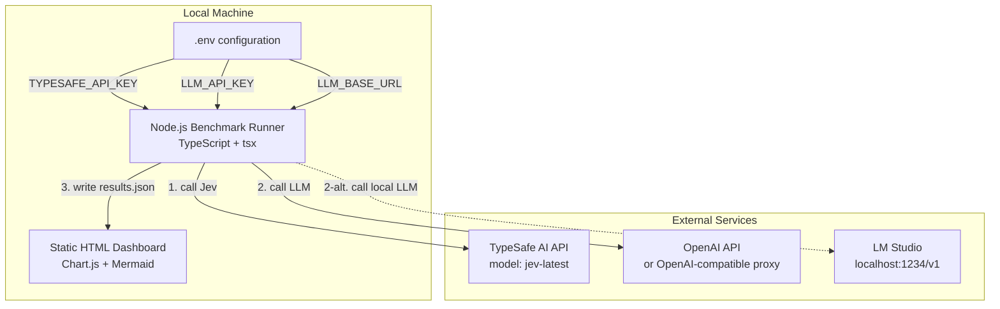
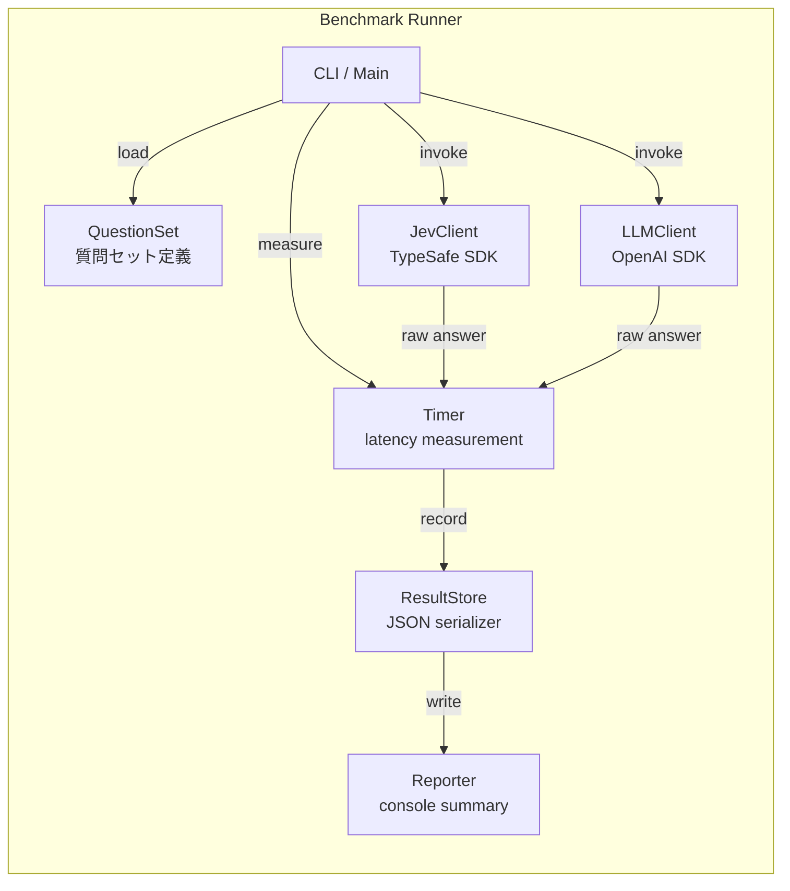
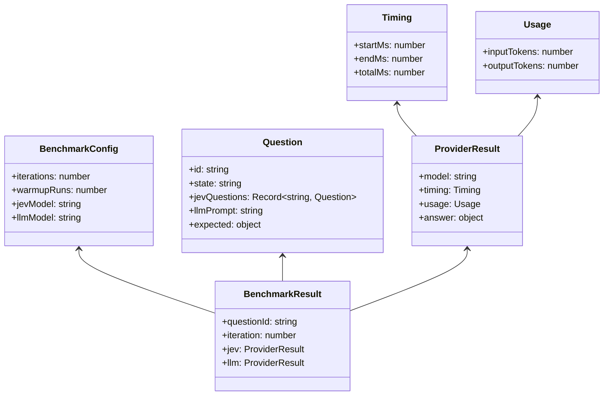

# Jev vs LLM Latency Benchmark

TypeSafe [Jev](https://typesafe.ai)（System One モデル）と、OpenAI 互換 LLM（OpenAI API / LM Studio など）の**回答速度・正解率・回答一致率**を比較するベンチマークツールです。

同じ state に対して両方のモデルに構造化された判断を依頼し、レイテンシと回答品質を並べて可視化します。

## 特徴

- **Jev vs LLM のレイテンシ比較**
  - 質問ごとの平均レイテンシ ± 標準偏差
  - 速度差（倍率）
- **回答品質の可視化**
  - 各モデルの期待値（模範解答）一致率
  - Jev と LLM の回答一致率
  - 質問ごとの一致/不一致を色分け表示
- **LM Studio 対応**
  - `LLM_BASE_URL` でローカル LLM サーバーを指定可能
- **カスタム入力対応**
  - コマンドラインから任意のテキストを追加
  - JSON ファイルから複数入力を一括読み込み
- **C4 モデル設計書付き**
  - `docs/c4-model.md` に Context / Container / Component / Code を記載

## クイックスタート

```bash
git clone https://github.com/yourname/jev-llm-benchmark.git
cd jev-llm-benchmark
npm install
cp .env.example .env
# .env に API キーと LLM エンドポイントを設定
npm run bench
npm run serve
```

ブラウザで `http://localhost:3000/` を開きます。

## 使い方

### ベンチマーク実行

```bash
# デフォルトの質問セットで計測
npm run bench

# カスタム入力を追加
npm run bench -i "決済が失敗します"

# ファイルから複数入力を読み込み、デフォルト質問はスキップ
npm run bench --questions-file data/test-questions.json --skip-defaults

# イテレーション数とウォームアップ回数を変更
npm run bench --iterations 5 --warmup 2
```

### ダッシュボード確認

```bash
npm run serve
```

`http://localhost:3000/public/` をブラウザで開きます。

## 設定

`.env` ファイルで設定します。

```env
# TypeSafe AI API key
TYPESAFE_API_KEY=your_typesafe_api_key_here

# LLM API 設定（OpenAI または OpenAI 互換エンドポイント）
# LM Studio の場合: LLM_BASE_URL=http://localhost:1234/v1
LLM_BASE_URL=https://api.openai.com/v1
LLM_API_KEY=your_llm_api_key_here
LLM_MODEL=gpt-4o-mini

# ベンチマーク設定
ITERATIONS=3
WARMUP_RUNS=1
JEV_MODEL=jev-latest
```

## 質問セットのカスタマイズ

`src/questions.ts` の `questions` 配列を編集するか、外部 JSON ファイルを用意します。

### 外部 JSON ファイルの形式

```json
[
  "任意のテキスト",
  { "id": "custom-1", "state": "別のテキスト" }
]
```

## GitHub Pages へのデプロイ

1. このリポジトリを GitHub にプッシュ
2. Settings → Pages → Source を **GitHub Actions** に設定
3. GitHub Actions ワークフロー `.github/workflows/deploy.yml` が自動的に `public/` ディレクトリをデプロイ

**デモ用サンプル結果**: 初回デプロイ時に `public/data/results.json` が存在しない場合、自動的にサンプル結果が生成されます。

**実測結果を公開する場合**:

```bash
npm run bench
cp data/results.json public/data/results.json
git add public/data/results.json
git commit -m "Update benchmark results"
git push
```

`public/data/results.json` は `.gitignore` で除外されていないため、コミットすると GitHub Pages に反映されます。`data/results.json` はローカル実行結果として引き続き除外されます。

## C4 設計モデル

### C1 - System Context


### C2 - Container



| コンテナ | 責務 | 技術 |
| --- | --- | --- |
| Benchmark Runner | 質問セットを読み込み、両APIを呼び出し、レイテンシとusageを計測・保存 | Node.js 20+, TypeScript, tsx |
| Static HTML Dashboard | results.json を読み込み、表・グラフを表示 | Vanilla HTML + Chart.js |
| .env configuration | APIキーなどの機密情報を分離管理 | dotenv |
| TypeSafe AI API | System One モデル Jev が構造化回答を返す | HTTPS JSON API |
| OpenAI API | 生成LLMがテキスト/JSON回答を返す | HTTPS JSON API |
| LM Studio | ローカルで動作するOpenAI互換API（任意） | HTTP JSON API on localhost |

### C3 - Component



### C4 - Code



## 注意点

- **API キーは決してコミットしないでください**。`.env` は `.gitignore` で除外されています。
- **比較の公平性**: Jev は System One（構造化判断）モデル、LLM は生成モデルです。役割が異なるため、単純な速度比較ではなく、ユースケースに応じた比較としてご利用ください。
- **結果の再現性**: モデルバージョン、サーバー負荷、ネットワーク環境、ハードウェアによってレイテンシは変動します。
- **LM Studio の制約**: LM Studio の OpenAI 互換 API は `response_format: { type: "json_object" }` をサポートしていないため、本ツールは `text` モード + JSON 抽出方式を使用しています。

## ライセンス

MIT
