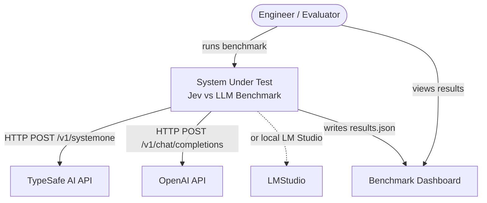
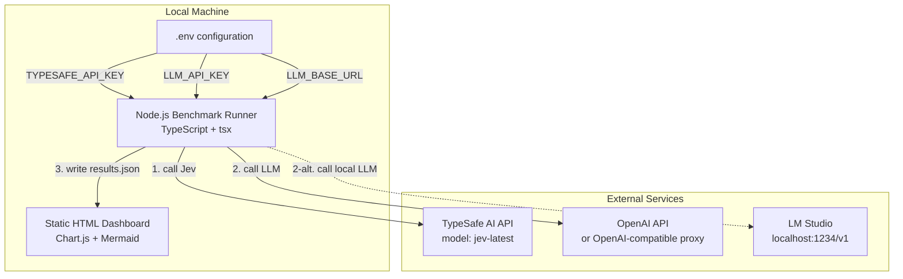
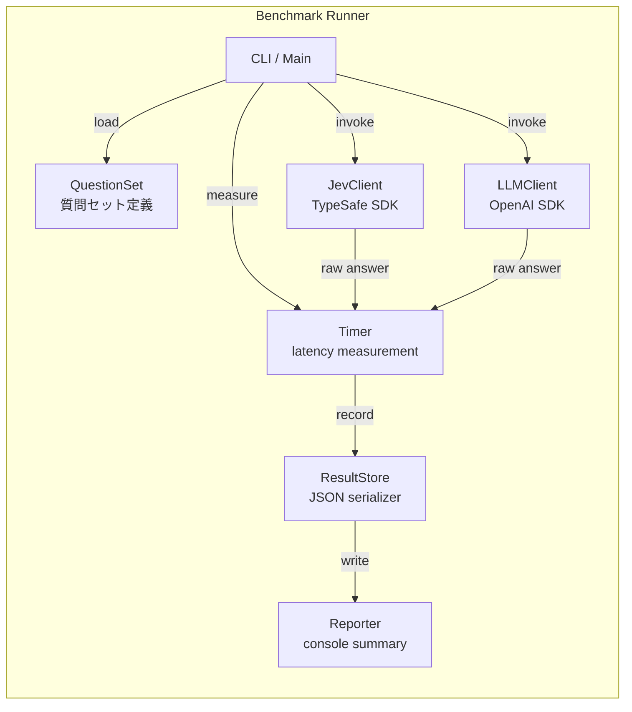
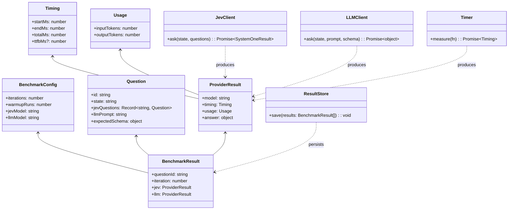

# C4 Model: Jev vs LLM Latency Benchmark

## C1 - System Context

### 説明
- 評価者が同じ質問セットを TypeSafe Jev（System One）と通常の生成LLM（OpenAI GPT-4o-mini）に投げ、回答速度を計測する。
- 結果は静的HTMLダッシュボードで可視化される。

---

## C2 - Container

### コンテナ一覧
| コンテナ | 責務 | 技術 |
| --- | --- | --- |
| Benchmark Runner | 質問セットを読み込み、両APIを順次・並列で呼び出し、レイテンシとusageを計測・保存 | Node.js 20+, TypeScript, tsx |
| Static HTML Dashboard | results.json を読み込み、表・グラフ・C4図を表示 | Vanilla HTML + Chart.js + Mermaid |
| .env configuration | APIキーなどの機密情報を分離管理 | dotenv |
| TypeSafe AI API | System One モデル Jev が構造化回答を返す | HTTPS JSON API |
| OpenAI API | 生成LLMがテキスト/JSON回答を返す | HTTPS JSON API |
| LM Studio | ローカルで動作するOpenAI互換API（任意） | HTTP JSON API on localhost |

---

## C3 - Component

### コンポーネント一覧
| コンポーネント | 責務 |
| --- | --- |
| CLI / Main | 実行フロー制御、ウォームアップ、反復回数設定 |
| QuestionSet | ベンチマーク用のstate + 質問を定義。Jev用のtyped questionsとLLM用のJSONスキーマ両方を生成 |
| JevClient | `@typesafe-ai/sdk` を使い、`systemOne()` を呼び出す。Noul/Choice/Scoreを1リクエストで送信 |
| LLMClient | `openai` SDK を使い、`LLM_BASE_URL` で指定されたOpenAI互換エンドポイント（OpenAIまたはLM Studio）に問い合わせ、JSON回答を取得 |
| Timer | `performance.now()` で `start` / `end` を計測し、TTFBとtotal latencyを記録 |
| ResultStore | 測定結果を `data/results.json` に書き出し |
| Reporter | コンソールにサマリー（平均レイテンシ、速度差）を出力 |

---

## C4 - Code

### 設計上の判断
- **コードがワークフローを支配**: TypeSafeの推奨通り、判断の使い分けと閾値はコード側で保持。モデルは「何か」を答え、コードが「どう使うか」を決める。
- **同じstate・同じ意味の問いで比較**: JevのChoice/Score/Noulと、LLMのJSONモード出力を意味的に対応させることで、速度差だけを測定。
- **APIキーはserver-side**: フロントエンドにはキーを置かず、Node.jsランナーのみが.envを読む。
- **結果は静的JSON**: ダッシュボードは結果ファイルを読むだけで、外部APIを直接叩かない。
