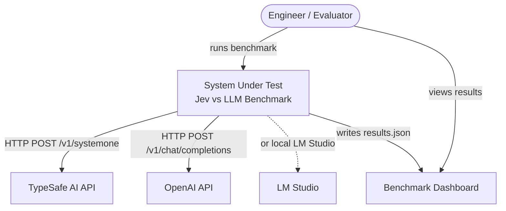
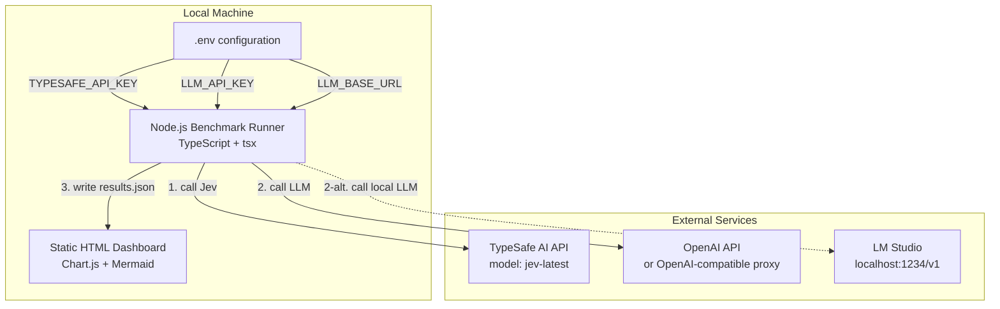
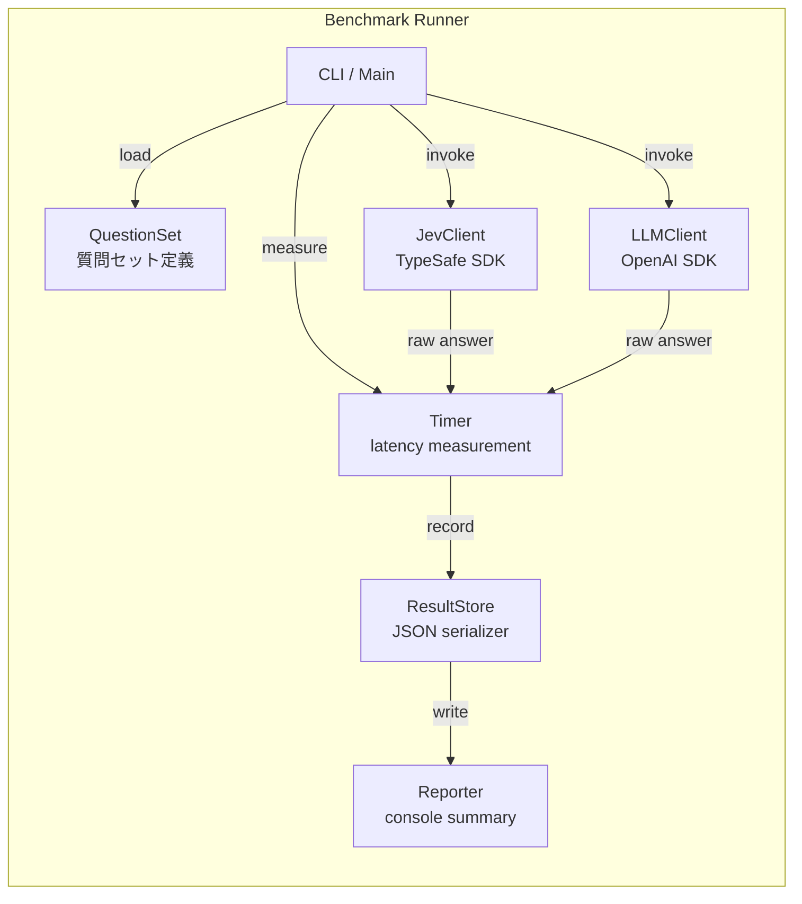
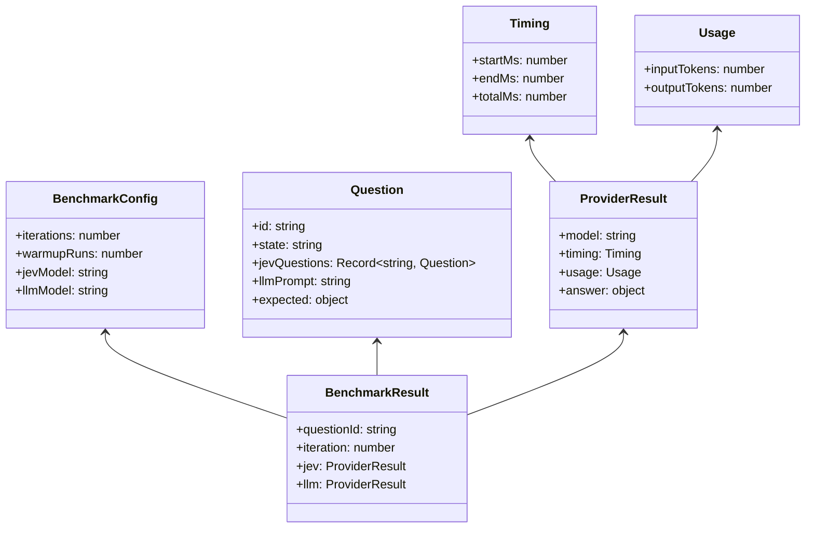

# C4 設計モデル

Jev vs LLM Benchmark のアーキテクチャを C4 モデル（Context / Container / Component / Code）で記述します。

## C1 - System Context

## C2 - Container

| コンテナ | 責務 | 技術 |
| --- | --- | --- |
| Benchmark Runner | 質問セットを読み込み、両APIを呼び出し、レイテンシとusageを計測・保存 | Node.js 20+, TypeScript, tsx |
| Static HTML Dashboard | results.json を読み込み、表・グラフを表示 | Vanilla HTML + Chart.js |
| .env configuration | APIキーなどの機密情報を分離管理 | dotenv |
| TypeSafe AI API | System One モデル Jev が構造化回答を返す | HTTPS JSON API |
| OpenAI API | 生成LLMがテキスト/JSON回答を返す | HTTPS JSON API |
| LM Studio | ローカルで動作するOpenAI互換API（任意） | HTTP JSON API on localhost |

## C3 - Component

ソース対応：`src/benchmark.ts`（CLI / Timer / ResultStore / Reporter）、`src/questions.ts`（QuestionSet）、`src/clients.ts`（JevClient / LLMClient）、`src/types.ts`（型定義）。

## C4 - Code

型の正本は `src/types.ts` を参照してください。
